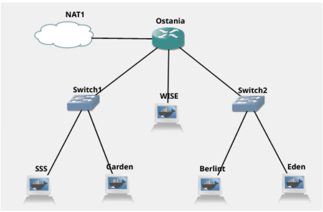
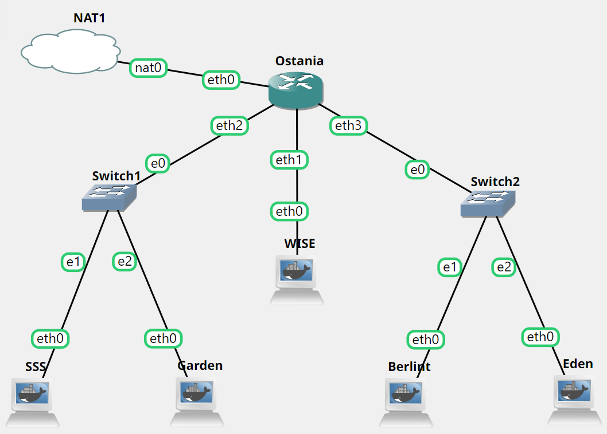
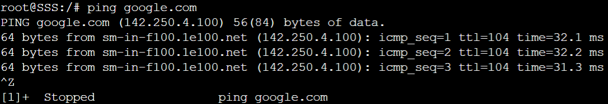
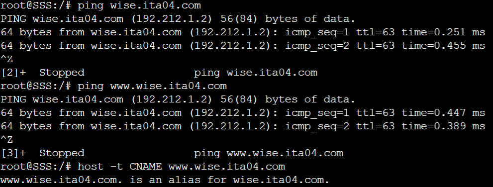
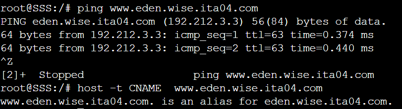
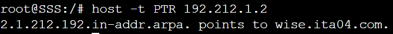
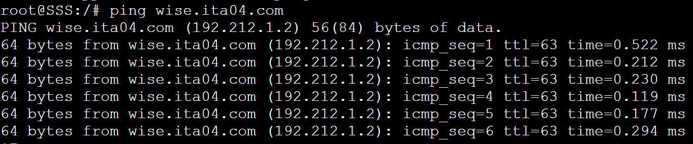
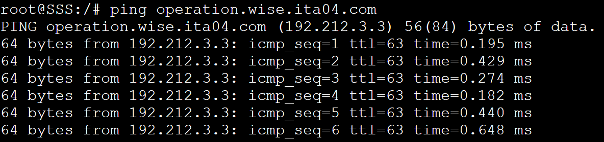
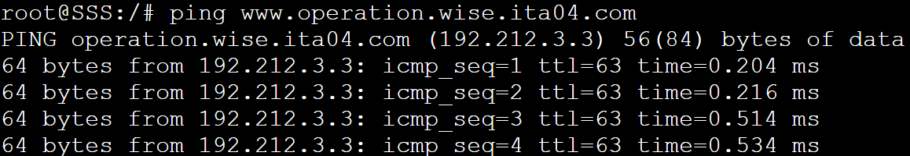
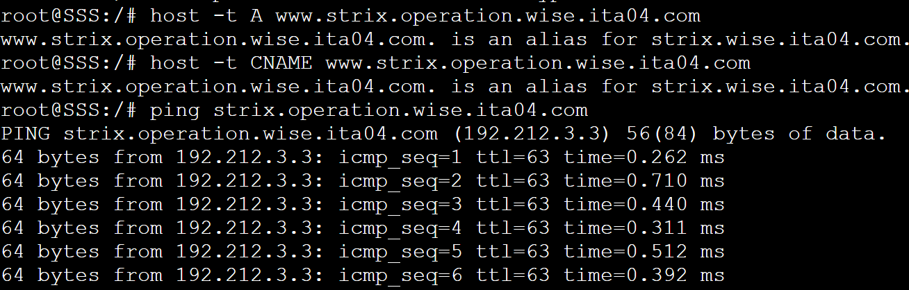

# Jarkom-Modul-2-ITA04-2022
Nama Anggota | NRP
------------------- | --------------		
Nida'ul Faizah | 5027201064
Kevin Oktoaria | 5027201046
Najwa Amelia Qorry 'Aina | 5027201001

## Soal 1
Twilight (〈黄昏 (たそがれ) 〉, <Tasogare>) adalah seorang mata-mata yang berasal dari negara Westalis. Demi menjaga perdamaian antara Westalis dengan Ostania, Twilight dengan nama samaran Loid Forger (ロイド・フォージャー, Roido Fōjā) di bawah organisasi WISE menjalankan operasinya di negara Ostania dengan cara melakukan spionase, sabotase, penyadapan dan kemungkinan pembunuhan. Berikut adalah peta dari negara Ostania:

WISE akan dijadikan sebagai DNS Master, Berlint akan dijadikan DNS Slave, dan Eden akan digunakan sebagai Web Server. Terdapat 2 Client yaitu SSS, dan Garden. Semua node terhubung pada router Ostania, sehingga dapat mengakses internet.

#### Jawab
Membuat Topologi pada GNS3 sebagai berikut:


Dengan konfigurasi setiap node:
##### Konfigurasi Ostania
```
auto eth1
iface eth1 inet static
	address 192.212.1.1
	netmask 255.255.255.0

auto eth2
iface eth2 inet static
	address 192.212.2.1
	netmask 255.255.255.0

auto eth3
iface eth3 inet static
	address 192.212.3.1
	netmask 255.255.255.0
```

##### Konfigurasi SSS
```
auto eth0
iface eth0 inet static
	address 192.212.2.2
	netmask 255.255.255.0
	gateway 192.212.2.1
```

##### Konfigurasi Garden
```
auto eth0
iface eth0 inet static
	address 192.212.2.3
	netmask 255.255.255.0
	gateway 192.212.2.1
```

##### Konfigurasi WISE
```
auto eth0
iface eth0 inet static
	address 192.212.1.2
	netmask 255.255.255.0
    gateway 192.212.1.1
```

##### Konfigurasi Berlint
```
auto eth0
iface eth0 inet static
	address 192.212.3.2
	netmask 255.255.255.0
	gateway 192.212.3.1
```

##### Konfigurasi Eden
```
auto eth0
iface eth0 inet static
	address 192.212.3.3
	netmask 255.255.255.0
	gateway 192.212.3.1
```
Dalam script bash ostania.sh kami  memasukkan command 
```bash
iptables -t nat -A POSTROUTING -o eth0 -j MASQUERADE -s 192.212.0.0/16
cat /etc/resolv.conf
```

Selanjutnya, di script node lainnya emasukkan command
```
echo "nameserver 192.168.122.1" > /etc/resolv.conf
```

##### Testing
Berhasil terhubung dengan internet


## Soal 2
Untuk mempermudah mendapatkan informasi mengenai misi dari Handler, bantulah Loid membuat website utama dengan akses wise.yyy.com dengan alias www.wise.yyy.com pada folder wise.

#### Jawab
Pertama melakukan update package lists dan install aplikasi bind9 pada WISE. Kemudian, membuat konfigurasi doamin `wise.ita04.com` pada file `/etc/bind/named.conf.local` dan buat folder wise pada /etc/bind dengan command sebagai berikut:
##### Script wise.sh
```
echo nameserver 192.168.122.1 > /etc/resolv.conf
apt-get update -y
apt-get install bind9 -y
echo "
zone \"wise.ita04.com\" {
	type master;
	file \"/etc/bind/wise/wise.ita04.com\";
};
"> /etc/bind/named.conf.local

mkdir -p /etc/bind/wise
```
Langkah selanjutnya, membuat konfigurasi domain menjadi www.ita04.com lalu membuat CNAME www untuk wise.ita04.com dengan cara melakukan konfigurasi pada file `/etc/bind/wise/wise.ita04.com`, command sebagai berikut:
##### Script wise.sh
```
echo "
;
; BIND data file for local loopback interface
;
\$TTL    604800
@       IN      SOA     wise.ita04.com. root.wise.ita04.com. (
                              2         ; Serial
                         604800         ; Refresh
                          86400         ; Retry
                        2419200         ; Expire
                         604800 )       ; Negative Cache TTL
;
@               IN      NS      wise.ita04.com.
@               IN      A       192.212.1.2
www             IN      CNAME   wise.ita04.com.
"> /etc/bind/wise/wise.ita04.com
```

##### Testing
Berhasil mencoba ping ke `wise.ita04.com` dan `www.wise.ita04.com` serta mengecek CNAME dari `www.wise.ita04.com`


## Soal 3
Setelah itu ia juga ingin membuat subdomain eden.wise.yyy.com dengan alias www.eden.wise.yyy.com yang diatur DNS-nya di WISE dan mengarah ke Eden.

#### Jawab
Dilakukan dengan menambahkan konfigurasi pada file `/etc/bind/wise/wise.ita04.com`, command sebagai berikut:
##### Script wise.sh
```
echo "
;
; BIND data file for local loopback interface
;
\$TTL    604800
@       IN      SOA     wise.ita04.com. root.wise.ita04.com. (
                              2         ; Serial
                         604800         ; Refresh
                          86400         ; Retry
                        2419200         ; Expire
                         604800 )       ; Negative Cache TTL
;
@               IN      NS      wise.ita04.com.
@               IN      A       192.212.1.2
www             IN      CNAME   wise.ita04.com.
eden            IN      A       192.212.3.3
www.eden        IN      CNAME   eden.wise.ita04.com.
"> /etc/bind/wise/wise.ita04.com
```

##### Testing
Me-restart service bind9 dan kemudian mencoba ping serta mengecek IPv4 address dari `eden.wise.ita04.com`


Mencoba ping `www.eden.wise.ita04.com` serta cek alias dari `www.eden.wise.ita04.com`


## Soal 4
Buat reverse domain untuk domain utama.

#### Jawab
Pertama, menambahkan konfigurasi pada file `/etc/bind/named.conf.local`, command sebagai berikut:
##### Script wise.sh
```
zone \"1.212.192.in-addr.arpa\" {
	type master;
	file \"/etc/bind/wise/1.212.192.in-addr.arpa\";
};
```
Kemudian ditambahkan juga konfigurasi yang ada pada file `/etc/bind/wise/1.212.192.in-addr.arpa` seperti berikut:
```
echo "
;
; BIND data file for local loopback interface
;
\$TTL    604800
@       IN      SOA     wise.ita04.com. root.wise.ita04.com. (
                              2         ; Serial
                         604800         ; Refresh
                          86400         ; Retry
                        2419200         ; Expire
                         604800 )       ; Negative Cache TTL
;
1.212.192.in-addr.arpa. IN      NS      wise.ita04.com.
2                       IN      PTR     wise.ita04.com.
" > /etc/bind/wise/1.212.192.in-addr.arpa
```

##### Testing
Mengecek host yang ditunjuk dari reverse domain utama


## Soal 5
Agar dapat tetap dihubungi jika server WISE bermasalah, buatlah juga Berlint sebagai DNS Slave untuk domain utama 

#### Jawab
Untuk menjadikan Berlint sebagai DNS Slave, kami melakukan konfigurasi pada `/etc/bind/named.conf.local` menjadi sebagai berikut:
##### Pada Wise
```
zone \"wise.ita04.com\" {
	type master;
	notify yes;
	also-notify { 192.212.3.2; };
	allow-transfer { 192.212.3.2; };
	file \"/etc/bind/wise/wise.ita04.com\";
};

zone \"1.212.192.in-addr.arpa\" {
	type master;
	file \"/etc/bind/wise/1.212.192.in-addr.arpa\";
};
```
##### Pada Berlint
Melakukan `apt-get update` dan menginstall bind9 dengan cara `apt-get install bind9 -y` dikarenakan Berlint akan dijadikan DNS Slave

Adapun konfigurasi pada file `/etc/bind/named.conf.local` sebagai berikut: 
```
zone \"wise.ita04.com\" {
    type slave;
    masters { 192.212.1.2; };
    file \"/var/lib/bind/wise.ita04.com\";
};
```
Setelah itu lakukan restart sevice bind9 dengan `service bind9 restart`

##### Testing
Pertama, kami memberhentikan service bind9 pada Wise menggunakan `service bind9 stop` kemudian melakukan ping pada SSS


## Soal 6
Karena banyak informasi dari Handler, buatlah subdomain yang khusus untuk operation yaitu operation.wise.yyy.com dengan alias www.operation.wise.yyy.com yang didelegasikan dari WISE ke Berlint dengan IP menuju ke Eden dalam folder operation 

#### Jawab
Pertama kita harus ke Wise dahulu dimana kita akan mengkonfigurasikan wise.ita04.com di `/etc/bind/wise/wise.ita04.com`

##### Pada Wise
```
$TTL    604800
@       IN      SOA     wise.ita04.com. root.wise.ita04.com. (
                              2         ; Serial
                         604800         ; Refresh
                          86400         ; Retry
                        2419200         ; Expire
                         604800 )       ; Negative Cache TTL
;
@               IN      NS      wise.ita04.com.
@               IN      A       192.212.1.2
www             IN      CNAME   wise.ita04.com.
eden            IN      A       192.212.3.3
www.eden        IN      CNAME   eden.wise.ita04.com.
ns1             IN      A       192.212.3.2
operation       IN      NS      ns1
```
Selain itu kami juga menambahkan konfigurasi `allow-query{any;};` pada `/etc/bind/named.conf.options` seperti pada berikut ini:
```
options {
        directory \"/var/cache/bind\";
        // If there is a firewall between you and nameservers you want
        // to talk to, you may need to fix the firewall to allow multiple
        // ports to talk.  See http://www.kb.cert.org/vuls/id/800113
        // If your ISP provided one or more IP addresses for stable 
        // nameservers, you probably want to use them as forwarders.  
        // Uncomment the following block, and insert the addresses replacing 
        // the all-0's placeholder.
        // forwarders {
        //      0.0.0.0;
        // };
        //========================================================================
        // If BIND logs error messages about the root key being expired,
        // you will need to update your keys.  See https://www.isc.org/bind-keys
        //========================================================================
        //dnssec-validation auto;
        allow-query{any;};

        auth-nxdomain no;    # conform to RFC1035
        listen-on-v6 { any; };
};
```

##### Pada Berlint
Kami juga menambahkan zone pada file `/etc/bind/named.conf.local` pada Berlint untuk mendelegasikan `operation.wise.ita04.com`
```
zone \"wise.ita04.com\" {
    type slave;
    masters { 192.212.1.2; };
    file \"/var/lib/bind/wise.ita04.com\";
};
zone \"operation.wise.ita04.com\" {
        type master;
        file \"/etc/bind/operation/operation.wise.ita04.com\";
```

Terakhir, kami membuat direktori baru yaitu `/etc/bind/operation/operation.wise.ita04.com` dan mengedit konfigurasinya agar terlihat seperti berikut:
```
$TTL    604800
@       IN      SOA     operation.wise.ita04.com. root.operation.wise.ita04.com. (
                              2         ; Serial
                         604800         ; Refresh
                          86400         ; Retry
                        2419200         ; Expire
                         604800 )       ; Negative Cache TTL
;
@               IN      NS      operation.wise.ita04.com.
@               IN      A       192.212.3.3
www             IN      CNAME   operation.wise.ita04.com.
```

##### Testing
Di SSSS, kami melakukan ping pada `opperation.wise.ita04.com` dan juga `wwww.opperation.wise.ita04.com`



## Soal 7
Untuk informasi yang lebih spesifik mengenai Operation Strix, buatlah subdomain melalui Berlint dengan akses `strix.operation.wise.yyy.com` dengan alias `www.strix.operation.wise.yyy.com` yang mengarah ke Eden

#### Jawab
Pada soal ini kami hanya perlu menambahkan konfigurasi pada file `/etc/bind/operation/operation.wise.ita04.com` sehingga terlihat seperti berikut ini:

##### Pada Berlint
```
$TTL    604800
@       IN      SOA     operation.wise.ita04.com. root.operation.wise.ita04.com$
                              2         ; Serial
                         604800         ; Refresh
                          86400         ; Retry
                        2419200         ; Expire
                         604800 )       ; Negative Cache TTL
;
@               IN      NS      operation.wise.ita04.com.
@               IN      A       192.212.3.3
www             IN      CNAME   operation.wise.ita04.com.
strix           IN      A       192.212.3.3
www.strix       IN      CNAME   strix.operation.wise.ita04.com.
```

##### Testing
Pada SSS, kami melakukan ping seperti berikut ini:


