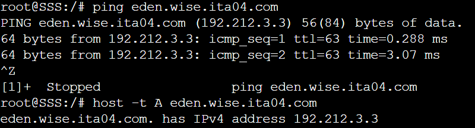

# Jarkom-Modul-2-ITA04-2022
Nama Anggota | NRP
------------------- | --------------		
Nida'ul Faizah | 5027201064
Kevin Oktoaria | 5027201046
Najwa Amelia Qorry 'Aina | 5027201001

## Soal 1
WISE akan dijadikan sebagai DNS Master, Berlint akan dijadikan DNS Slave, dan Eden akan digunakan sebagai Web Server. Terdapat 2 Client yaitu SSS, dan Garden. Semua node terhubung pada router Ostania, sehingga dapat mengakses internet.

#### Jawab
Membuat Topologi pada GNS3 sebagai berikut:


Dengan konfigurasi setiap node:
##### Konfigurasi Ostania
```
auto eth1
iface eth1 inet static
	address 192.212.1.1
	netmask 255.255.255.0

auto eth2
iface eth2 inet static
	address 192.212.2.1
	netmask 255.255.255.0

auto eth3
iface eth3 inet static
	address 192.212.3.1
	netmask 255.255.255.0
```

##### Konfigurasi SSS
```
auto eth0
iface eth0 inet static
	address 192.212.2.2
	netmask 255.255.255.0
	gateway 192.212.2.1
```

##### Konfigurasi Garden
```
auto eth0
iface eth0 inet static
	address 192.212.2.3
	netmask 255.255.255.0
	gateway 192.212.2.1
```

##### Konfigurasi WISE
```
auto eth0
iface eth0 inet static
	address 192.212.1.2
	netmask 255.255.255.0
    gateway 192.212.1.1
```

##### Konfigurasi Berlint
```
auto eth0
iface eth0 inet static
	address 192.212.3.2
	netmask 255.255.255.0
	gateway 192.212.3.1
```

##### Konfigurasi Eden
```
auto eth0
iface eth0 inet static
	address 192.212.3.3
	netmask 255.255.255.0
	gateway 192.212.3.1
```
Dalam script bash ostania.sh kami  memasukkan command 
```bash
iptables -t nat -A POSTROUTING -o eth0 -j MASQUERADE -s 192.212.0.0/16
cat /etc/resolv.conf
```

Selanjutnya, di script node lainnya emasukkan command
```
echo "nameserver 192.168.122.1" > /etc/resolv.conf
```

##### Testing
Berhasil terhubung dengan internet


## Soal 2
Untuk mempermudah mendapatkan informasi mengenai misi dari Handler, bantulah Loid membuat website utama dengan akses wise.yyy.com dengan alias www.wise.yyy.com pada folder wise.

#### Jawab
Pertama melakukan update package lists dan install aplikasi bind9 pada WISE. Kemudian, membuat konfigurasi doamin `wise.ita04.com` pada file `/etc/bind/named.conf.local` dan buat folder wise pada /etc/bind dengan command sebagai berikut:
##### Script wise.sh
```
echo nameserver 192.168.122.1 > /etc/resolv.conf
apt-get update -y
apt-get install bind9 -y
echo "
zone \"wise.ita04.com\" {
	type master;
	file \"/etc/bind/wise/wise.ita04.com\";
};
"> /etc/bind/named.conf.local

mkdir -p /etc/bind/wise
```
Langkah selanjutnya, membuat konfigurasi domain menjadi www.ita04.com lalu membuat CNAME www untuk wise.ita04.com dengan cara melakukan konfigurasi pada file `/etc/bind/wise/wise.ita04.com`, command sebagai berikut:
##### Script wise.sh
```
echo "
;
; BIND data file for local loopback interface
;
\$TTL    604800
@       IN      SOA     wise.ita04.com. root.wise.ita04.com. (
                              2         ; Serial
                         604800         ; Refresh
                          86400         ; Retry
                        2419200         ; Expire
                         604800 )       ; Negative Cache TTL
;
@               IN      NS      wise.ita04.com.
@               IN      A       192.212.1.2
www             IN      CNAME   wise.ita04.com.
"> /etc/bind/wise/wise.ita04.com
```

##### Testing
Berhasil mencoba ping ke `wise.ita04.com` dan `www.wise.ita04.com` serta mengecek CNAME dari `www.wise.ita04.com`


## Soal 3
Setelah itu ia juga ingin membuat subdomain eden.wise.yyy.com dengan alias www.eden.wise.yyy.com yang diatur DNS-nya di WISE dan mengarah ke Eden.

#### Jawab
Dilakukan dengan menambahkan konfigurasi pada file `/etc/bind/wise/wise.ita04.com`, command sebagai berikut:
##### Script wise.sh
```
echo "
;
; BIND data file for local loopback interface
;
\$TTL    604800
@       IN      SOA     wise.ita04.com. root.wise.ita04.com. (
                              2         ; Serial
                         604800         ; Refresh
                          86400         ; Retry
                        2419200         ; Expire
                         604800 )       ; Negative Cache TTL
;
@               IN      NS      wise.ita04.com.
@               IN      A       192.212.1.2
www             IN      CNAME   wise.ita04.com.
eden            IN      A       192.212.3.3
www.eden        IN      CNAME   eden.wise.ita04.com.
"> /etc/bind/wise/wise.ita04.com
```

##### Testing
Me-restart service bind9 dan kemudian mencoba ping serta mengecek IPv4 address dari `eden.wise.ita04.com`


Mencoba ping `www.eden.wise.ita04.com` serta cek alias dari `www.eden.wise.ita04.com`


## Soal 4
Buat reverse domain untuk domain utama.

#### Jawab
Pertama, menambahkan konfigurasi pada file `/etc/bind/named.conf.local`, command sebagai berikut:
##### Script wise.sh
```
zone \"1.212.192.in-addr.arpa\" {
	type master;
	file \"/etc/bind/wise/1.212.192.in-addr.arpa\";
};
```
Kemudian ditambahkan juga konfigurasi yang ada pada file `/etc/bind/wise/1.212.192.in-addr.arpa` seperti berikut:
```
echo "
;
; BIND data file for local loopback interface
;
\$TTL    604800
@       IN      SOA     wise.ita04.com. root.wise.ita04.com. (
                              2         ; Serial
                         604800         ; Refresh
                          86400         ; Retry
                        2419200         ; Expire
                         604800 )       ; Negative Cache TTL
;
1.212.192.in-addr.arpa. IN      NS      wise.ita04.com.
2                       IN      PTR     wise.ita04.com.
" > /etc/bind/wise/1.212.192.in-addr.arpa
```

##### Testing
Mengecek host yang ditunjuk dari reverse domain utama

